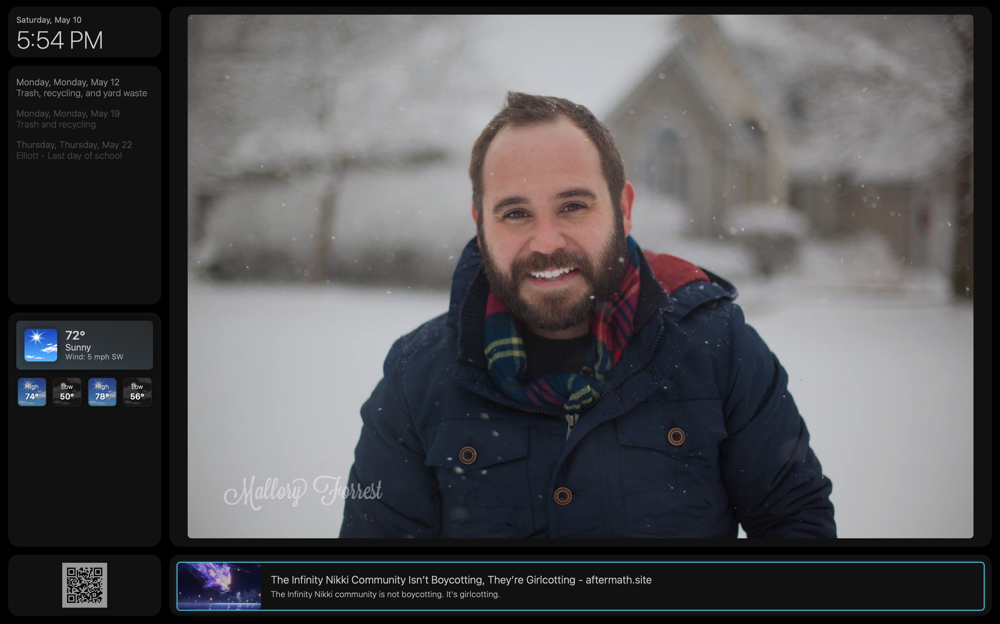

# Dashatron

This is Dashatron, a DIY dashboard for Raspberry Pi (or any browser) that pulls in stuff like weather, calendars, photos, and headlines, and throws it up on a dark-mode screen. Built to run on a TV, fridge screen, or whatever you’ve got laying around. It's meant to be simple in both function and use, displaying the  things I wanted to see while I make coffee in the morning without having to look at my phone. 

## What It Does

- 📅 Pulls in multiple calendars (iCloud, Recollect, holidays, etc)
- 🌤️ Current weather + hourly + 5-day via National Weather Service
- 📰 News headlines from NewsAPI.org with thumbnails and summaries
- 🖼️ Auto-rotating photo gallery with upload support from your phone
- 🕹️ CEC + arrow key navigation support (remote or keyboard)
- 🔁 APIs refresh themselves, frontend updates automatically
- 🎨 Fully stylable with your own CSS

## Setup

1. **Install dependencies**:
   ```bash
   npm install
   ```

2. **Make a `.env` file** in the root:
   ```env
   WEATHER_LAT=...
   WEATHER_LON=...
   USER_EMAIL=...
   NEWS_API_KEY=...
   CALENDAR_URLS=... # comma-separated
   ```

3. **Start it**:
   ```bash
   npm start
   ```

4. Hit it in your browser at [http://localhost:3000](http://localhost:3000)

## Folder Layout

```
Dashatron/
├── api/          # News, weather, calendar, uploader
├── Public/       # HTML, JS, CSS, templates
├── uploads/      # Uploaded images (git-ignored)
├── .env          # Your secrets (don't commit)
├── config.js     # Constants and intervals
├── server.js     # Express app
└── package.json
```

## Versioning

Following [semver](https://semver.org/):
- Major: Breaks stuff
- Minor: Adds stuff
- Patch: Fixes stuff

## License

MIT. Do what you want with it.

## Screenshots



## Why I Built This

I started with MagicMirror and liked the concept, but I hit walls trying to customize it the way I wanted: clickable elements, better layout control, cleaner photo handling, etc. Rather than hack around someone else's structure, I built my own.

This is mostly a personal project to learn how Node, APIs, and modular frontends all work together... but if you're trying to do something similar or want a cleaner base to build off of, maybe this will help. It's not perfect, but it’s mine, and now it's yours too.